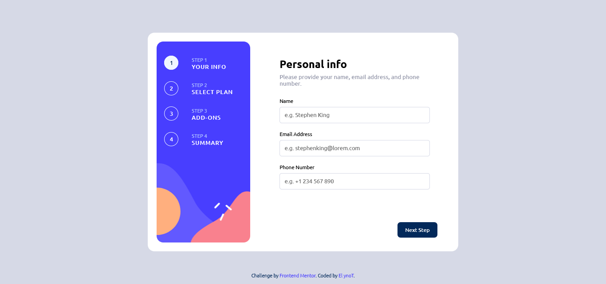

# Frontend Mentor - Multi-step form solution

This is a solution to the [Multi-step form challenge on Frontend Mentor](https://www.frontendmentor.io/challenges/multistep-form-YVAnSdqQBJ). Frontend Mentor challenges help you improve your coding skills by building realistic projects.

## Table of contents

- [Overview](#overview)
  - [The challenge](#the-challenge)
  - [Screenshot](#screenshot)
  - [Links](#links)
- [My process](#my-process)
  - [Built with](#built-with)
  - [What I learned](#what-i-learned)
  - [Continued development](#continued-development)
- [Author](#author)

## Overview

### The challenge

Users should be able to:

- Complete each step of the sequence
- See a summary of their selections on the final step and confirm their order
- View the optimal layout for the interface depending on their device's screen size
- See hover and focus states for all interactive elements on the page

### Screenshot



### Links

- Live Site URL: [here](https://msf-form.netlify.app)

## My process

### Built with

- Semantic HTML5 markup
- CSS custom properties
- Flexbox
- CSS Grid
- [Vanilla JS](https://developer.mozilla.org/en-US/docs/Web/JavaScript) - Plain Javascript

### What I learned

I learnt a few more ways to manipulate CSS classes and Pseudo-classes

```css
#next.confirm {
  background-color: var(--purplish-blue);
}

#next.confirm:hover {
  background-color: var(--purplish-blue-hover);
}
```

### Continued development

Plan to learn CSS Grid and practice more with the Flexbox.

## Author

- Frontend Mentor - [@Arnthorny](https://www.frontendmentor.io/profile/Arnthorny)
- Twitter - [@arn_thorny](https://twitter.com/Arn_thorny)
